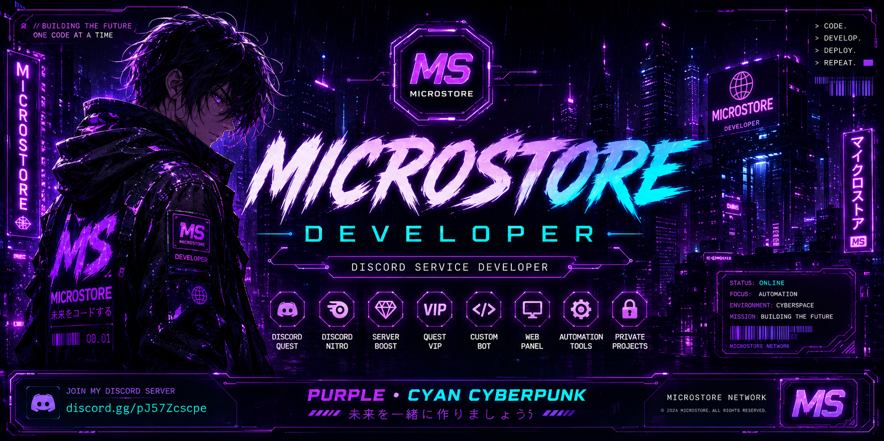

⚡ MICROSTORE DEVELOPER ⚡

Cyberpunk Discord Bot Developer

 
---

🌐 MICROSTORE COMMUNITY

---

🚀 ABOUT ME

Name: MICROSTORE
Role: Discord Bot Developer
Theme: Cyberpunk Purple + Cyan
Focus: Discord Automation
Project: MICROSTORE BOT DISCORD
Status: Active Development

---

⚙️ TECH STACK

---

📊 GITHUB STATS

---

🔥 GITHUB STREAK

---

💜 CURRENT PROJECT

+ MICROSTORE BOT DISCORD
+ Discord Automation
+ Cyberpunk Development
+ Community Management
+ Active Updates

---

⚡ ENTER THE FUTURE ⚡

<a href="https://discord.gg/pJ57Zcscpe">
JOIN MY DISCORD SERVER
</a>

